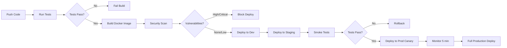

# 🚀 CI/CD Pipeline - Netflix Mercados API

Pipeline completo de Integração e Entrega Contínua usando GitHub Actions.

## 📋 Índice

- [Visão Geral](#visão-geral)
- [Workflows Disponíveis](#workflows-disponíveis)
- [Configuração](#configuração)
- [Ambientes](#ambientes)
- [Segredos Necessários](#segredos-necessários)
- [Deploy Pipeline](#deploy-pipeline)
- [Monitoramento](#monitoramento)

## 🎯 Visão Geral

O pipeline CI/CD automatiza completamente o processo de:
- ✅ Testes unitários e integração
- ✅ Análise de cobertura (JaCoCo)
- ✅ Build da aplicação
- ✅ Build e push de imagem Docker
- ✅ Scans de segurança (Trivy, CodeQL, OWASP)
- ✅ Testes de performance (JMeter, Gatling)
- ✅ Deploy automático (Dev → Staging → Production)
- ✅ Notificações (Slack)

## 📁 Workflows Disponíveis

### 1. CI/CD Pipeline (`.github/workflows/ci-cd.yml`)

**Triggers:**
- Push em `main` ou `develop`
- Pull requests para `main` ou `develop`
- Manual (`workflow_dispatch`)

**Jobs:**
1. **test**: Testes unitários + integração + cobertura
2. **build**: Build Maven da aplicação
3. **docker-build**: Build e push da imagem Docker
4. **deploy-dev**: Deploy automático em desenvolvimento
5. **deploy-staging**: Deploy automático em staging
6. **deploy-production**: Deploy com canary em produção
7. **notify**: Notificações Slack

**Fluxo:**
```
┌──────┐    ┌───────┐    ┌──────────────┐    ┌────────────┐
│ Test │ -> │ Build │ -> │ Docker Build │ -> │ Deploy Dev │
└──────┘    └───────┘    └──────────────┘    └────────────┘
                                                     |
                                              ┌──────────────┐
                                              │Deploy Staging│
                                              └──────────────┘
                                                     |
                                              ┌──────────────┐
                                              │ Deploy Prod  │
                                              └──────────────┘
```

### 2. Security Scan (`.github/workflows/security-scan.yml`)

**Triggers:**
- Push em `main` ou `develop`
- Pull requests para `main`
- Agendado: Segunda-feira às 00:00
- Manual

**Jobs:**
1. **dependency-check**: OWASP Dependency Check
2. **codeql-analysis**: GitHub CodeQL (SAST)
3. **trivy-scan**: Trivy filesystem scan
4. **snyk-scan**: Snyk vulnerabilities
5. **secret-scan**: TruffleHog secret detection

### 3. Performance Test (`.github/workflows/performance-test.yml`)

**Triggers:**
- Push em `main`
- Pull requests para `main`
- Agendado: Domingo às 02:00
- Manual

**Jobs:**
1. **jmeter-test**: JMeter load testing (100 users, 5 min)
2. **gatling-test**: Gatling performance testing

## ⚙️ Configuração

### Pré-requisitos

1. **GitHub Container Registry**
   - Habilitado automaticamente para repositórios GitHub

2. **Kubernetes Clusters**
   - Dev, Staging, Production configurados

3. **GitHub Secrets**
   - Ver seção [Segredos Necessários](#segredos-necessários)

### Habilitar Workflows

1. Fork/Clone do repositório
2. Navegue para **Settings** → **Actions** → **General**
3. Selecione **Allow all actions and reusable workflows**
4. Configure os secrets necessários

## 🌍 Ambientes

### Development
- **Branch**: `develop`
- **URL**: https://api-dev.netflix-mercados.com
- **Deploy**: Automático em push
- **Namespace**: `netflix-mercados-dev`

### Staging
- **Branch**: `main`
- **URL**: https://api-staging.netflix-mercados.com
- **Deploy**: Automático após testes
- **Namespace**: `netflix-mercados-staging`

### Production
- **Branch**: `main`
- **URL**: https://api.netflix-mercados.com
- **Deploy**: Canary (10% → 100%)
- **Namespace**: `netflix-mercados`
- **Approval**: Requer aprovação manual no GitHub

## 🔐 Segredos Necessários

Configure em **Settings** → **Secrets and variables** → **Actions**:

| Secret | Descrição | Exemplo |
|--------|-----------|---------|
| `KUBE_CONFIG_DEV` | Kubeconfig base64 (Dev) | `cat ~/.kube/config \| base64` |
| `KUBE_CONFIG_STAGING` | Kubeconfig base64 (Staging) | `cat ~/.kube/config \| base64` |
| `KUBE_CONFIG_PROD` | Kubeconfig base64 (Prod) | `cat ~/.kube/config \| base64` |
| `SLACK_WEBHOOK` | URL do webhook Slack | `https://hooks.slack.com/...` |
| `SNYK_TOKEN` | Token da API Snyk | `snyk-...` |
| `CODECOV_TOKEN` | Token Codecov (opcional) | `codecov-...` |

### Como criar Kubeconfig secret

```bash
# 1. Obter kubeconfig do cluster
kubectl config view --flatten --minify > kubeconfig-dev.yaml

# 2. Converter para base64
cat kubeconfig-dev.yaml | base64 -w 0

# 3. Adicionar como secret no GitHub
# Settings → Secrets → New repository secret
# Name: KUBE_CONFIG_DEV
# Value: (colar o base64)
```

## 🚀 Deploy Pipeline

### Fluxo Completo



### Deploy Manual

Para fazer deploy manual em qualquer ambiente:

```bash
# 1. Acesse Actions no GitHub
# 2. Selecione "CI/CD Pipeline"
# 3. Clique em "Run workflow"
# 4. Escolha a branch
# 5. Clique em "Run workflow"
```

### Rollback

```bash
# Via kubectl
kubectl rollout undo deployment/netflix-mercados-api \
  --namespace=netflix-mercados

# Ou via GitHub Actions
# Re-executar workflow de uma versão anterior
```

## 📊 Monitoramento

### GitHub Actions

- **Status**: https://github.com/SEU_USER/SEU_REPO/actions
- **Métricas**: Tempo de build, taxa de sucesso, coverage

### Code Coverage

- **JaCoCo Reports**: Gerados em cada build
- **Codecov**: Dashboard online (se configurado)
- **Threshold**: Min 80% overall, 70% changed files

### Security Scanning

- **GitHub Security**: Security → Code scanning alerts
- **Dependabot**: Automatic dependency updates
- **Trivy**: Container vulnerability reports

### Performance

- **JMeter Reports**: Artifacts após cada teste
- **Gatling**: HTML reports detalhados

## 🔧 Troubleshooting

### Build Falhando

```bash
# Verificar logs
gh run view <run-id> --log

# Rodar testes localmente
mvn clean verify

# Verificar Docker build local
docker build -t test .
```

### Deploy Falhando

```bash
# Verificar secret
echo $KUBE_CONFIG_DEV | base64 -d | kubectl config view --flatten

# Testar conexão Kubernetes
kubectl get pods --namespace=netflix-mercados-dev

# Verificar rollout status
kubectl rollout status deployment/netflix-mercados-api
```

### Security Scan Bloqueando

```bash
# Ver vulnerabilidades
gh api repos/:owner/:repo/code-scanning/alerts

# Atualizar dependências
mvn versions:use-latest-releases

# Re-scan
gh workflow run security-scan.yml
```

## 📈 Métricas e KPIs

### Build Metrics
- **Build Time**: Target < 10 min
- **Test Time**: Target < 5 min
- **Deploy Time**: Target < 3 min

### Quality Metrics
- **Code Coverage**: Min 80%
- **Test Success Rate**: > 95%
- **Security Vulnerabilities**: 0 High/Critical

### Deployment Metrics
- **Deployment Frequency**: Daily (dev), 2-3x/week (prod)
- **Lead Time**: < 30 min (commit → production)
- **MTTR**: < 15 min
- **Change Failure Rate**: < 5%

## 🎯 Próximos Passos

1. ✅ Configurar Codecov para coverage tracking
2. ✅ Adicionar smoke tests pós-deploy
3. ✅ Implementar feature flags
4. ✅ Configurar rollback automático
5. ✅ Adicionar testes E2E
6. ✅ Integrar com Datadog/New Relic

## 📚 Recursos

- [GitHub Actions Docs](https://docs.github.com/en/actions)
- [Docker Build Docs](https://docs.docker.com/build/)
- [Kubernetes Deployments](https://kubernetes.io/docs/concepts/workloads/controllers/deployment/)
- [JaCoCo Maven Plugin](https://www.jacoco.org/jacoco/trunk/doc/maven.html)

---

**Pipeline criado por**: Netflix Mercados DevOps Team  
**Última atualização**: 2024  
**Status**: ✅ Production Ready
